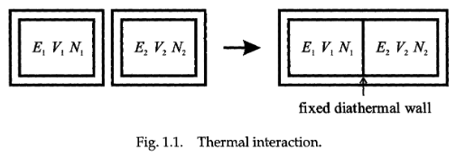
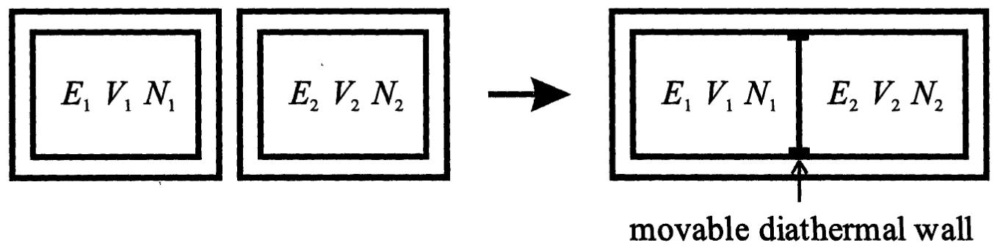

#### 1.1.2 Description of states

Macrostate(宏观状态)

Microstate

统计力学的核心方法：基于微观态的概率性论证，将宏观态视为微观态的统计平均值。

#### 1.1.3 Extensivity and the thermodynamic limit(广延性与热力学极限)

Extensive Quantities(广延量)广延量的数值与系统的 “规模”（如粒子总数、空间范围）直接相关，是系统整体属性的体现。

Intensive Quantities(内涵量)内涵量的数值与系统的 “规模” 无关，是系统局部属性的体现。

Thermodynamic Limit(热力学极限) 定义：指系统粒子数
N→∞、体积V→∞，且粒子数密度N/V保持恒定的极限状态。这是统计力学中分析宏观系统行为的关键前提。
核心作用：广延量的 “严格相加性” 仅在热力学极限下成立。例如，对于实际系统，表面效应会导致能量等广延量的相加性出现偏差（表面粒子的相互作用环境与内部粒子不同），但在热力学极限下，系统体积远大于表面积，表面效应的影响可忽略，广延量的相加性才能严格满足。

## 1.2 The Fundamental Principle

#### 1.2.1 The  Law of thermodynamics

- Zeroth law：
A-B $\land$ A-C $\rightarrow$ B-C
- First law：
$$\Delta E = \Delta Q + \Delta W$$
- Second law：
Heat flows from hot to cold, or It is not possible to convert all heat energy to work. These statements

There is an extensive quantity,
which we call entropy, which never decreases in a physical process. 

- Third law：The entropy of a body tends to zero as the temperature tends
to absolute zero.

#### 1.2.2. Probabilistic interpretation of the First Law(第一定律的概率解释)

$$ E = \sum_{j} P_{j} E_{j} $$

微分：

$$ \text{d}E = \sum_{j} p_j \text{d}E_j + \sum_{j} E_j \text{d}p_j $$

$\sum_{j} p_j \text{d}E_j$ 对应微观态自身能量水平的变化
$\sum_{j} E_j \text{d}p_j$ 对应微观态出现概率的变化，因为热量传递不改变微观态的能级本身，仅改变粒子在各能级上的分布概率。

---
#### 1.2.3. Microscopic basis for entropy（熵的微观基础）
- Fundamental Postulate of
statistical mechanics：
All microstates of an
isolated system are equally likely.

$$ P \propto \Omega(E,V,N) $$

$\Omega(E,V,N)$ is the number of microstates in a given macrostate (E, V, N). 

the equilibrium(平衡) state corresponds(对应) to the macrostate with the largest number of microstates. $\rightarrow$ Q is maximum for an equilibrium state.

##### Boltzmann Entropy Formula（玻尔兹曼熵公式）
$$ S = k \ln \Omega $$

k is Boltzmann constant.

- 定义依据：由于两个孤立系统组合后，总微观态数量满足 “乘积性(系统 1 的每一个微观态都能与系统 2 的每一个微观态搭配，形成复合系统的一个新微观态。)”（ $\Omega_{\text{总}} = \Omega_1 \times \Omega_2$ ），而熵作为广延量需满足 “加和性”，因此对
Ω
取对数（对数可将乘积转化为加和）

## 1.3. Interactions - The Conditions for Equilibrium

#### 1.3.1. Thermal intersction - Temperature

$$ \Omega = \Omega_1(E_1) \times \Omega_2(E_2) $$

$$ E_0 = E_1 + E_2 = const$$

$$ \Omega = \Omega_1(E) \times \Omega_2(E_0 - E) $$

$$
\begin{align*}
\frac{\partial \Omega}{\partial E} &= \frac{\partial \Omega_1}

{\partial E} \Omega_2 - \Omega_1 \frac{\partial \Omega_2}{\partial E} = 0 \\
\frac{1}{\Omega_1} \frac{\partial \Omega_1}{\partial E} &= \frac{1}{\Omega_2} \frac{\partial \Omega_2}

{\partial E} \\
\frac{\partial \ln \Omega_1}{\partial E} &= \frac{\partial \ln \Omega_2}{\partial E}
\end{align*}
$$

$$
\Delta S = \left( \frac{\partial S_1}{\partial E} - \frac{\partial S_2}{\partial E} \right) \Delta E_1 \geq 0
$$

$E_1$ increases if $\frac{\partial S_1}{\partial E} > \frac{\partial S_2}{\partial E}$

$E_1$ decreases if $\frac{\partial S_1}{\partial E} < \frac{\partial S_2}{\partial E}$

$$
\text{High } T \equiv \text{Low } \frac{\partial S}{\partial E}
$$

$$
\text{Low } T \equiv \text{High } \frac{\partial S}{\partial E}
$$

$$
\frac{1}{T} = \frac{\partial S}{\partial E}
$$

#### 1.3.2. Volume change - pressure

 $$  E_1 + E_2 = E_0 = \text{const.}$$
 $$ 
  V_1 + V_2 = V_0 = \text{const.} $$

对能量和体积最大化熵

$$\frac{\partial S_1}{\partial E} = \frac{\partial S_2}{\partial E} $$
$$\frac{\partial S_1}{\partial V} = \frac{\partial S_2}{\partial V} $$

without a flow of heat,thermodynamic equilibrium is not possible.